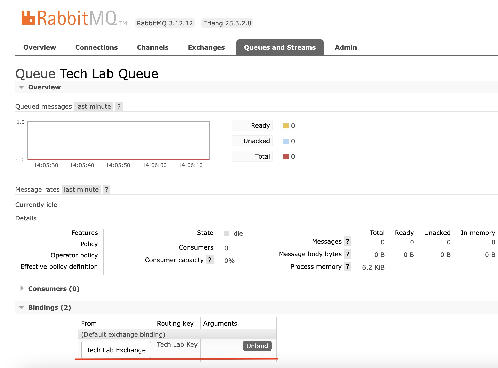

# Problem Definition: ✨Consumer✨

##  Instructions
Create a .py file that will contain a class that is setup to be a consumer in the RabbitMQ framework. This class will inherit from the mqConsumerInterface and consume and print a simple UTF-8 string message. 

Below are bullet points of the criteria:
- In the `solution` directory, create a file named `consumer_sol.py`
- Write your code in the `consumer_sol.py` file
- Create a class named `mqConsumer`
- Your class should inherit from our mqConsumerInterface.
- Constructor: Save the three variables needed to instantiate the class.
- Constructor: Call the setupRMQConnection function.
- setupRMQConnection Function: Establish connection to the RabbitMQ service, declare a queue and exchange, bind the binding key to the queue on the exchange and finally set up a callback function for receiving messages
- onMessageCallback: Print the UTF-8 string message and then close the connection.
- startConsuming:  Consumer should start listening for messages from the queue.
- Del: Close Connection and Channel.

## Testing
In order to verify that the consumer class was properly instantiated, we will use the provided  `consume.py`, file. Follow the below instructions:
1. Start consumer
* To test your implementation you can run `consume.py`. It will import your newly created class from the source file `consume_sol.py` in the `solution` directory.
2. Log Into the RabbitMQ website.
* The login URL for the management web application will be http://localhost:15672/
* Login username and password should be `guest`
3. Check Queue
* Click on tab `Queues and Streams`.
* Under this tab you should see your created Queue appropriately named `Tech Lab Queue`

4. Check Binding
* Click on the "Tech Lab Queue" 
* You should see under `Bindings` that the Queue is bound to the exchange `Tech Lab Exchange` with the key `Tech Lab Key`

